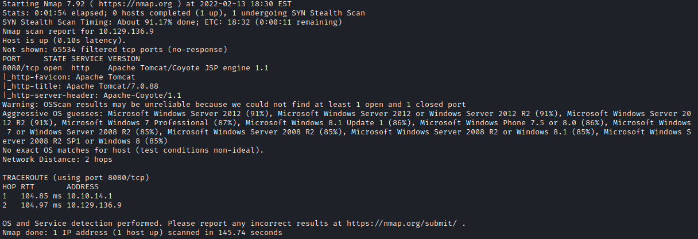
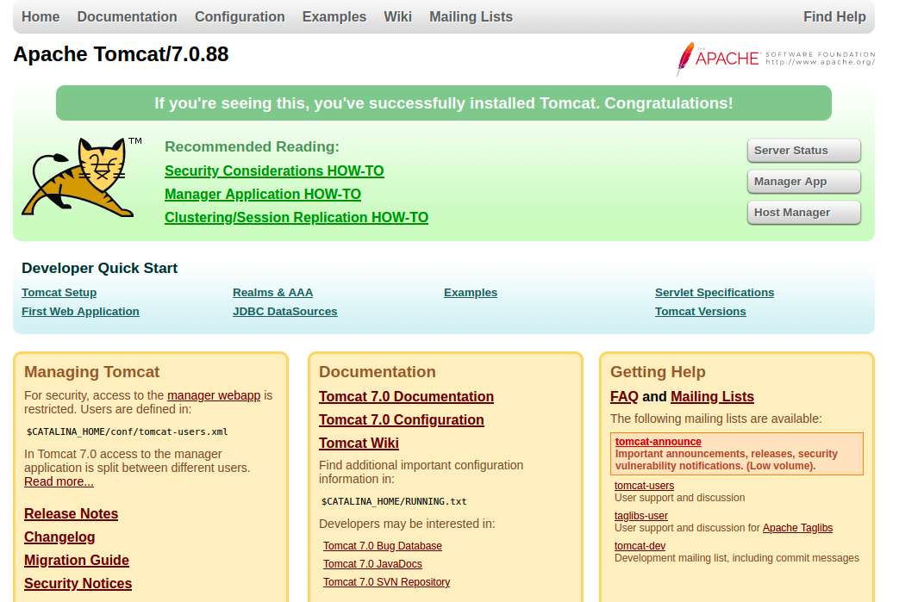

# Nibbles
## Summary
Jerry is a retired Virtual machine on the Hack The Box platform and it is at an Easy Difficulty rating. I used my Openvpn configuration file to access the network and connect to the machine.

This report is a summarized document on how one can break into and own the machine. It is not an exact representation on how I broke into the box and is more streamlined.

## Tools
I used a Kali Linux VM with the following tools to scan, enumerate, break into the machine:

* Nmap
* msfconsole

When running commands I work as the root user simply because that’s where I’m comfortable working. If commands don’t work exactly the same for you, try prepending sudo to the command.

## Stages

***

### Prehack
I started with making a folder to hold my scans and output from commands. ~/jerry I also created a section in my OneNote notes for quick notes I may need to take.

After creating my documentation directory and notes, I started the machine on hack the box. My Target ran on 10.129.136.9

Form here I connected to the Hack the Box VPN.

***

### Scanning
#### ping
It may be training but I always ping the Target machine before doing anything, just to confirm my set up is correct.  

`ping 10.129.136.9`  

With a response I moved forward with my scanning. I don’t rely on a response, I just like having it as confirmation. 

#### nmap
I started with scanning the target machine with nmap. I used the command:  

`nmap -p- -sS -sC -A -T4 10.129.136.9 -oA initScan`

This scan only picked up a single port that was open: 8080

I can see from the scan that apache tomcat is running on this port. With that information I open the webpage in my Firefox web-browser.

#### Firefox
I opened http://10.129.136.9:8080 in the firefox and found a page the following page:

I tried logging into the web app section of tomcat and when I guessed some incorrect creds, I was routed to a auth failure page. On that page was suggestion for creds: tomcat:s3cret

These credentials worked for me thankfully and I was able to access the tomcat management page. 

***

### Gaining Access
#### msfconsole
If simple guessing didn’t work for me I could have also used the msfconsole module auxiliary/scanner/http/tomcat_mgr_login to brute-force the creds.

At this point I can use the exploit/multi/http/tomcat_mgr_upload module. After entering the LHOST, RHOST, and RPORT all I need were the creds I collected:

* HttpPassword: s3cret
* HttpUsername: tomcat

With everything set I ran the module and gained access the system.

#### Finding the flags
The flags weren’t hard to find and didn’t require elevated privileges to collect. I found them in:  
C:/Users/Administrator/Desktop/flags/2\ for\ the\ price\ of\ 1.txt

***
## Review
Honestly this box was easy. I only had to google the msfconsole modules I used and the rest was just following were the clues lead. Not sure why the box didn’t require the attack to elevate privileges at all. It probably only took me 15-30mins to break in and document everything.