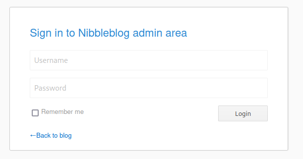

# Nibbles
## Summary
Nibbles is a retired Virtual machine on the Hack The Box platform. It is at an Easy Difficulty rating and is what most beginners start with. I used my Openvpn configuration file to access the network and connect to the machine. 

This report is a summarized document on how one can break into and own the machine. It is not an exact representation on how I broke into the box and is more streamlined.

## Tools
I used a Kali Linux VM with the following tools to scan, enumerate, break into the machine:
* Nmap
* gobuster
* msfconsole

When running commands I work as the root user simply because that’s where I’m comfortable working. If commands don’t work exactly the same for you, try prepending sudo to the command.

## Stages
### Prehack
I started with making a folder to hold my scans and output from commands. ~/nibbles I also created a section in my OneNote notes for quick notes I may need to take. 

After creating my documentation directory and notes, I started the machine on hack the box. My Target ran on 10.129.96.84

Form here I connected to the Hack the Box VPN.

***

### Scanning
#### ping
It may be training but I always ping the Target machine before doing anything, just to confirm my set up is correct.
`ping 10.129.96.84`
With a response I moved forward with my scanning

#### nmap
I started with scanning the target machine with nmap. I used the command:
`nmap -p- -sS -sC -A -T4 10.129.96.84 -oA initScan`

This picked up two ports: port 22 with open with ssh and port 80 had Apache httpd 2.4.18.

#### Firefox
I opened 10.129.96.84 in the firefox and found a page only consisting of “Hello World!”

I took a closer look at the page’s content and found the directory “/nibbleblog/“

#### gobuster
After getting to /nibbleblog/ I started to enumerate the directory. I used gobuster and the command:
`gobuster dir -wordlist=/usr/share/wordlists/dirbuster/directory-list-2.3-medium.txt -u http://10.129.96.84/nibbleblog/`

This enumerated some of the webapp and revealed the /nibbleblog/README and /nibbleblog/admin.php pages.

The README revealed that the version of the system was v4.0.3 and with a little googling I found a related CVE: CVE 2015-6967

#### msfconsole
After finding the CVE I looked it up in msfconsole:
`msfconsole -q`
`search CVE-2015-6967`

The related msf exploit was: exploit/multi/http/nibbleblog_file_upload. I attached it and reviewed it’s options.
`use exploit/multi/http/nibbleblog_file_upload`
`show options`

Beyond the basic RHOST and LHOST information, the exploit needs User login information and a TargetURL. The Target url is easy enough however we don’t have any login information.

***

### Gaining Access
#### Guessing Login Credentials
So, I started with using hydra to guess passwords for me. I did default with admin as the user as a guess. I used the command: ``

I found that nibbleblog rate limits guesses. At 5 incorrect guess it locks you out for 5 minutes. At this point, I had a couple choices to make. I could run a rate limited hydra command or I could try some targeted guesses.

I did some targeted guessing and after about 5 minutes, I guessed admin:nibbles

#### msfconsole

Now that I have all the information I needed I was able to use the handy metasploit module exploit/multi/http/nibbleblog_file_upload.

After running the command, I could access the target machine as nibble. Looking at the /home/nibble directory, I found user flag file.

***

### Escalating Privileges
#### sudo

